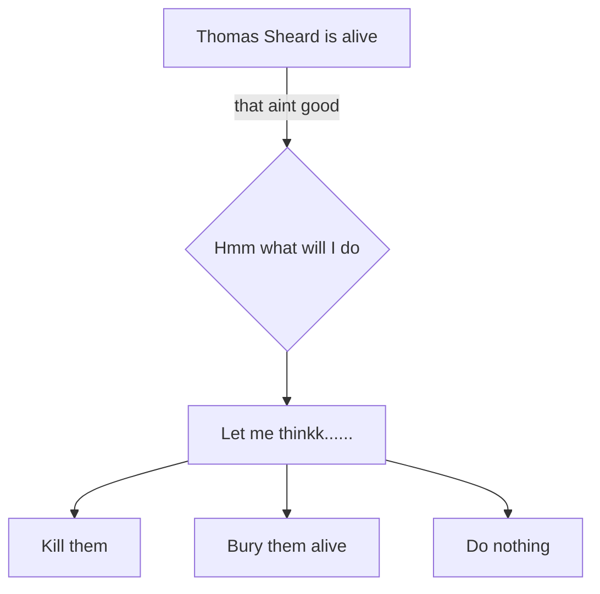

Parvaiz is a complex, dualist character in Shamsie's novel. On one hand, Parvaiz is a fun, humorous and family oriented character who has a passion for creative audio, shown especially in the section starting on page 116. Shamsie shows us this side of Parvaiz to show the injustices that otherwise ordinary, good people face when they are conditioned into joining ISIS. In my creative task I explore Parvaiz's personal side in 3 temporal settings. First, when he first starts talking to Farooq, second, when Parvaiz has a deeper relationship with Farooq and a growing yearn to pay legacy to his father, and third, when Parvaiz has joined ISIS and actively working on projects. These three larger temporal settings attempt to show the rapid process that Parvaiz undertakes to be radicalised. It reflects on his vulnerability as someone who is seeking masculinity and as someone who wants to reflect his father's achievements. The audio diary format reflects Parvaiz's love for audio. Farooq speaks softly in the first entry which speaks to the secrecy of his character in Shamsie's novel that she positions him as by only interacting with him through Parvaiz's character. The setting changes to a night-time scene from Parvaiz's train vantage point. Parvaiz recording his diary from home and Aneeka calling out to him gives Parvaiz his family oriented, humorous element. He mentions his friendship with Farooq, and how their fathers must have been friends, this is in reference to his fascination with the photo of their fathers in Farooq's house. This relates to Parvaiz's view of Farooq as someone who is a friend and someone to trust because of his father. The second recording is a number of flashes of audio to place a listener inside Parvaiz's mind in the time that he is realising the pain his father felt. The bus with the radio is used as an intermediary in this entry between Farooq's torture and his home life, showing the duality of Parvaiz. The duality of Parvaiz's character is shown especially through this contrast and the contrast between Aneeka's question and Parvaiz's manic tone saying "I need to do my father justice". The use of non diegetic sound is used in the last recording to communicate the overwhelming feeling of missing home that Parvaiz has and to transition to the sound of trains. The trains and humour is used in this entry as reminder of Parvaiz's life at home, contrasted with the trauma that Parvaiz feels from working at ISIS. 

