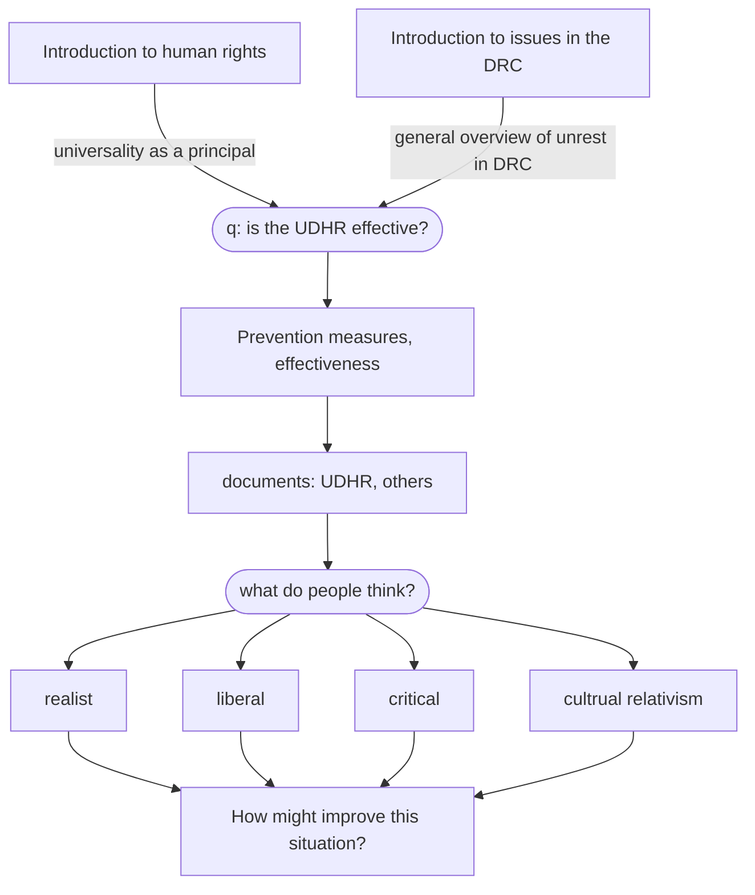

# Human Rights — Child Soldiers in the DRC
## Structure of my presentation

## Introduction
The Democratic Republic of Congo is one of the largest countries in land mass and population in Africa. The country thrived through the 14th -> 19th centuries until it was colonised and the population was devastated due to disease and slave labour. 1960 was the year that marked independence for the Congo, but also many years of civil unrest that persists to this day. The country has been through two separate wars that have since ceased but the violence in the region continues with over 100 different armed groups that are active to this day.

Human rights are a contested concept but in the modern, liberal world order the most accepted document in International Relations is the UN's Universal Declaration of Human Rights. The UN declares that there are 4 principles of human rights: 
1. Universality
2. Interdependency
3. Indivisibility
4. Inalienability
In relation to the issues in the DRC, universality is the most important principle listed here. 

[@CongoDemocraticRepublic2022]